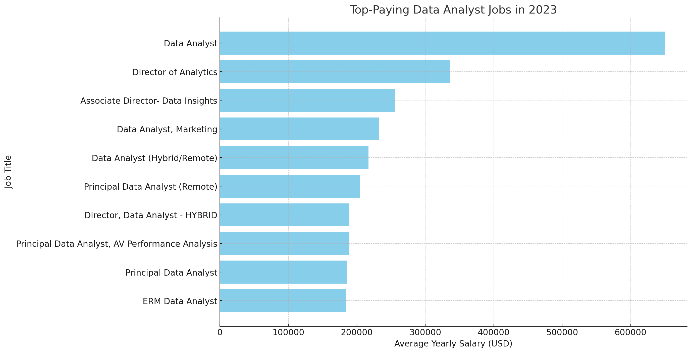

# Introduction
Let's dive into the data job market! Focusing on data analyst roles, this project will explore top paying jobsm in-demand skills, and where high demand meets high salary in data analytics.

Want to see the SQL queries? Check them out here: [project_sql folder](/project_sql/)
# Background
Ths project was born from a desire to learn about the top-paid and in-demand skills in order to streamline finding optimal jobs.

The data comes from a larger dataset of real-world data science job postings from 2023, which was posted by Luke Barousse.

### The questions I wanted to answer through my SQL queries were: 
1. What are the top-paying data analyst jobs?
2. What skills are required for these top-paying jobs?
3. What skills are most in demand for data analysts?
4. Which skills are associated with higher salaries?
5. What are the most optimal skills to learn?
# Tools I Used
For  my deep dive into the data analyst job market, I used the following key tools:

- **SQL**: The main component of my analysis, allowing me to query the database and discover important insights.
- **PostgreSQL**: The chosen database management system, ideal for handling the job posting data.
- **Visual Studio Code**: My go-to for database management and executing SQL queries
- **Git & Github**: Essential for version control and sharing my SQL scripts and analysis, ensuring collaboration and project tracking.
# The Analysis
Each query in this project aims to investigate certain aspects of the data analyst job market.
Here's how I approached each question:

### 1. Top Paying Data Analyst Jobs in Texas
To identify the highest-paying roles, I filtered data analyst positions by average yearly salary and location, focusing on Texas or remote jobs. This query highlights the high paying opportunities in the field.

```sql
SELECT 
    job_id,
    job_title,
    job_location,
    job_schedule_type,
    salary_year_avg,
    job_posted_date,
    company_dim.name AS company_name
FROM
    job_postings_fact
LEFT JOIN company_dim ON job_postings_fact.company_id = company_dim.company_id
WHERE 
    job_title_short = 'Data Analyst' AND
    (job_location = 'Texas' OR job_location = 'Anywhere') AND
    salary_year_avg IS NOT NULL
ORDER BY 
    salary_year_avg DESC
LIMIT 10;
```

Here's the insights I found of the top data analyst jobs in 2023:
- **💡Diverse Industry Representation:** High-paying data analyst positions span a variety of industries, including technology, telecommunications, healthcare, and marketing. This diversity highlights the widespread demand for data analytics expertise across different sectors.
- **💡Competitive Salaries in Tech Companies:** Tech companies like Meta and Pinterest are offering highly competitive salaries for data analyst roles. This trend underscores the critical role data analytics plays in driving business strategies and decisions in the tech industry.
- **💡Full-Time Remote Flexibility:** There is a strong trend of high-paying data analyst jobs offering remote or hybrid work options. This flexibility attracts top talent, which is reflected in the competitive salaries offered by companies like UCLA Healthcare Careers and SmartAsset.


*Bar graph visualizing the salary for the top 10 salaries for data analysts: ChatGPT generated this grapg from my SQL query results*

### 2. The Highest Paying Skills for Data Analyst Jobs.
To identify the highest paying skills, I used the top 10 highest-paying data analyst jobs and queried the associated skills with that posting. This query will give a detailed look at which skills they need to develop that align with top salaries.

```sql
WITH top_paying_jobs_texas_or_remote AS(
    SELECT 
        job_id,
        job_title,
        salary_year_avg,
        company_dim.name AS company_name
    FROM
        job_postings_fact
    LEFT JOIN company_dim ON job_postings_fact.company_id = company_dim.company_id
    WHERE 
        job_title_short = 'Data Analyst' AND
        (job_location = 'Texas' OR job_location = 'Anywhere') AND
        salary_year_avg IS NOT NULL
    ORDER BY 
        salary_year_avg DESC
    LIMIT 10
)

SELECT
    top_paying_jobs_texas_or_remote.*,
    skills_dim.skills
FROM top_paying_jobs_texas_or_remote
INNER JOIN skills_job_dim ON top_paying_jobs_texas_or_remote.job_id = skills_job_dim.job_id
INNER JOIN skills_dim ON skills_job_dim.skill_id = skills_dim.skill_id
ORDER BY
    salary_year_avg DESC
```

Here's the breakdown of the highest-paying skills for Data Analysts in 2023, based on job postings:
- **SQL** is leading with a count of ***8***.
- **Python** follows closely with ***7***. mentions.
- **Tableau** is also prominent with ***6*** occurrences.
- **R** appears ***4*** times, indicating its relevance.
- Tools like **Snowflake**, **Pandas**, and **Excel** each appear ***3*** times, highlighting their importance.

*The diversity of skills highlights the varied technical expertise expected for Data Analyst roles.*

### 3. Top 5 Most In-Demand Skills for Data Analysts.
To identify the most in-demand skills, I found all job postings related to data analytics and aggragated them by the skills needed.

```sql
SELECT
    skills,
    COUNT(skills_job_dim.job_id) AS demand_count
FROM job_postings_fact
INNER JOIN skills_job_dim ON job_postings_fact.job_id = skills_job_dim.job_id
INNER JOIN skills_dim ON skills_job_dim.skill_id = skills_dim.skill_id
WHERE -- Job title is Data Analyst and the position is Work From Home
    job_title_short = 'Data Analyst' AND
    job_work_from_home = True
GROUP BY
    skills
ORDER BY
    demand_count DESC
LIMIT 5
```

Here are the insights found:

- **💡SQL Dominance:** SQL is the most in-demand skill, with a significant lead over the other skills. This indicates that proficiency in SQL is crucial for data analyst roles, making it a foundational skill for the field.
 - **💡High Demand for General-Purpose Tools:**  Excel and Python are also highly sought-after skills, reflecting the importance of general-purpose tools in data analysis. Excel's strong demand highlights its ubiquitous use in business settings, while Python's popularity points to its versatility and power in data manipulation and analysis.
 - **💡Visualization Tools' Importance:** Tableau and Power BI, both powerful data visualization tools, are in considerable demand. This suggests that the ability to visualize and present data insights effectively is a critical competency for data analysts.

 | Skill    | Demand Count |
|----------|--------------|
| SQL      | 7291         |
| Excel    | 4611         |
| Python   | 4330         |
| Tableau  | 3745         |
| Power BI | 2609         |

*Table of the top 5 most in-demand skills in data analyst job postings*

### 4. Skills Based on Salary
Exploring the average salaries associated with different skills revealed which skills are the highest paying.

```sql
SELECT
    skills,
    ROUND(AVG(salary_year_avg), 0) AS avg_salary
FROM job_postings_fact
INNER JOIN skills_job_dim ON job_postings_fact.job_id = skills_job_dim.job_id
INNER JOIN skills_dim ON skills_job_dim.skill_id = skills_dim.skill_id
WHERE -- Job title is Data Analyst and the position is Work From Home
    job_title_short = 'Data Analyst'
    AND salary_year_avg IS NOT NULL 
    AND job_work_from_home = True
GROUP BY
    skills
ORDER BY
    avg_salary DESC
LIMIT 25 
```

The insights found are:
- **🔍 Top Skill Pays Premium:** Pyspark leads the list with an average salary of $208,172, indicating high demand for skills in big data processing frameworks.
- **📈 Niche Technologies Reward Well:** Skills like Bitbucket, Couchbase, and Watson are specialized, showing that niche technical skills or tools related to big data, version control, and AI can command higher salaries.
- **👨‍💻 Diverse Tech Stack Importance:** The variety in top-paying skills ranging from Jupyter and Pandas for data manipulation to Elasticsearch and Kubernetes for data storage and orchestration highlights the importance of having a diverse set of technical abilities.
These insights suggest that as a Data Analyst, focusing on big data technologies, niche tools, and a broad technical skill set could significantly enhance career prospects and earning potential.

| Skill         | Average Salary (USD) |
|---------------|----------------------|
| PySpark       | 208172               |
| Bitbucket     | 189155               |
| Couchbase     | 160515               |
| Watson        | 160515               |
| DataRobot     | 155486               |
| GitLab        | 154500               |
| Swift         | 153750               |
| Jupyter       | 152777               |
| Pandas        | 151821               |
| Elasticsearch | 145000               |
| Golang        | 145000               |
| NumPy         | 143513               |
| Databricks    | 141907               |
| Linux         | 136508               |
| Kubernetes    | 132500               |
| Atlassian     | 131162               |
| Twilio        | 127000               |
| Airflow       | 126103               |
| Scikit-learn  | 125781               |
| Jenkins       | 125436               |
| Notion        | 125000               |
| Scala         | 124903               |
| PostgreSQL    | 123879               |
| GCP           | 122500               |
| MicroStrategy | 121619               |

*Top 25 Skills Based on Yearly Average Salary*

### 5. The Most Optimal Skills to Learn
The most optimal are skills both in high demand and high paying. This query targets skills that offer job security and great financial benefits, offering strategic insights on for career development in data analytics.

```sql
SELECT
    skills_dim.skill_id,
    skills_dim.skills,
    COUNT(skills_job_dim.job_id) AS demand_count,
    ROUND(AVG(job_postings_fact.salary_year_avg), 0) AS avg_salary
FROM job_postings_fact
INNER JOIN skills_job_dim ON job_postings_fact.job_id = skills_job_dim.job_id
INNER JOIN skills_dim ON skills_job_dim.skill_id = skills_dim.skill_id
WHERE
    job_title_short = 'Data Analyst'
    AND salary_year_avg IS NOT NULL 
    AND job_work_from_home = True
GROUP BY
    skills_dim.skill_id
HAVING
    COUNT(skills_job_dim.job_id) > 10
ORDER BY
    avg_salary DESC,
    demand_count DESC
LIMIT 25;
```

Here are the insights found:
- **💡High Demand for Versatile Skills:** Skills like Python, Tableau, and R have the highest demand counts. This indicates that versatile skills, which can be used across various data analysis and visualization tasks, are highly sought after in the job market.
- **💡Competitive Salaries for Specialized Tools:** Specialized tools and languages such as Go, Confluence, and Hadoop command competitive salaries. This suggests that niche skills with lower demand counts can still offer high salaries due to their specialized nature and the expertise required.
- **💡Cloud and Big Data Technologies in Demand:** Cloud platforms and big data technologies like Snowflake, Azure, AWS, BigQuery, and Redshift are in significant demand. This highlights the importance of cloud computing and big data analytics skills in the current data analyst job market.

# What I learned
Throughout creating this project, I was able to sharpen my SQL toolkit:

- **Complex Query Crafting:** Used the art of advanced SQL to merge tables and wield WITH clauses for important temp table use cases.
- **Data Aggregation:** Got comfortable utilizing GROUP BY and aggregate functions like COUNT() and AVG() into a powerful data-summarizing skill.
- **Analytical Prowess:** Increased my real-world puzzle-solving skills, turning questions into actionable and insightful SQL queries.

# Conclusions 

### Insights
From the analysis, several key insights emerged:

1. **Top-Paying Data Analyst Jobs**: High-paying data analyst roles in 2023 span diverse industries, offer competitive salaries in tech companies, and frequently provide remote work options, reflecting strong demand and strategic importance of data analytics skills.
2. **Skills for Top-Paying Jobs**: High-paying data analyst jobs require advanced proficiency in SQL, suggesting it's a critical skill for earning a top salary.
3. **Most In-Demand Skills**: SQL is the most in-demand skill for data analysts, with Excel and Python also highly sought-after for their versatility. Additionally, proficiency in data visualization tools like Tableau and Power BI is crucial, reflecting the importance of effectively presenting data insights.
4. **Skills with High Salaries**: Focusing on big data technologies like Pyspark, specialized tools such as Bitbucket and Watson, and a diverse tech stack including Jupyter, Pandas, Elasticsearch, and Kubernetes can significantly enhance a data analyst's career prospects and earning potential, with top skills commanding premium salaries.
5. **Optimal Skills for Job Market Value**: Versatile skills like Python, Tableau, and R are highly demanded, while specialized tools like Go, Confluence, and Hadoop command competitive salaries. Additionally, cloud and big data technologies such as Snowflake, Azure, and AWS are crucial, underscoring the importance of a broad yet specialized skill set for data analysts.

### Closing Throughts

This project enhanced my SQL skills and provided valuable insights into the data analyst job market. The findings from the analysis serves as a guide to prioritizing skill development and job search efforts. Aspiring data analysts can better position themselved in a competitive job market by focusing on high-demand, high-salary skills. This exploration highlights the importance of continious learning and adaptation to emerging trends in the field of data analytics.
